* [概述](#%E6%A6%82%E8%BF%B0)
* [Cache高速缓冲存储器](#cache%E9%AB%98%E9%80%9F%E7%BC%93%E5%86%B2%E5%AD%98%E5%82%A8%E5%99%A8)
  * [Cache与主存的映射方式](#cache%E4%B8%8E%E4%B8%BB%E5%AD%98%E7%9A%84%E6%98%A0%E5%B0%84%E6%96%B9%E5%BC%8F)
  * [Cache写策略](#cache%E5%86%99%E7%AD%96%E7%95%A5)
* [主存管理](#%E4%B8%BB%E5%AD%98%E7%AE%A1%E7%90%86)
  * [概述](#%E6%A6%82%E8%BF%B0-1)
  * [连续分配管理方式](#%E8%BF%9E%E7%BB%AD%E5%88%86%E9%85%8D%E7%AE%A1%E7%90%86%E6%96%B9%E5%BC%8F)
    * [基于顺序搜索的动态分区分配算法](#%E5%9F%BA%E4%BA%8E%E9%A1%BA%E5%BA%8F%E6%90%9C%E7%B4%A2%E7%9A%84%E5%8A%A8%E6%80%81%E5%88%86%E5%8C%BA%E5%88%86%E9%85%8D%E7%AE%97%E6%B3%95)
    * [基于索引搜索的动态分区分配算法](#%E5%9F%BA%E4%BA%8E%E7%B4%A2%E5%BC%95%E6%90%9C%E7%B4%A2%E7%9A%84%E5%8A%A8%E6%80%81%E5%88%86%E5%8C%BA%E5%88%86%E9%85%8D%E7%AE%97%E6%B3%95)
  * [离散分配方式](#%E7%A6%BB%E6%95%A3%E5%88%86%E9%85%8D%E6%96%B9%E5%BC%8F)
* [虚拟存储器](#%E8%99%9A%E6%8B%9F%E5%AD%98%E5%82%A8%E5%99%A8)
  * [页面置换算法（略）](#%E9%A1%B5%E9%9D%A2%E7%BD%AE%E6%8D%A2%E7%AE%97%E6%B3%95%E7%95%A5)
  * [页面分配策略](#%E9%A1%B5%E9%9D%A2%E5%88%86%E9%85%8D%E7%AD%96%E7%95%A5)
  * [从虚拟地址到Cache查找内容](#%E4%BB%8E%E8%99%9A%E6%8B%9F%E5%9C%B0%E5%9D%80%E5%88%B0cache%E6%9F%A5%E6%89%BE%E5%86%85%E5%AE%B9)
* [磁盘组织与管理](#%E7%A3%81%E7%9B%98%E7%BB%84%E7%BB%87%E4%B8%8E%E7%AE%A1%E7%90%86%E4%B8%89%E7%BA%A7%E5%AD%98%E5%82%A8)
  * [概念与计算](#%E6%A6%82%E5%BF%B5%E4%B8%8E%E8%AE%A1%E7%AE%97)
  * [磁盘调度算法](#%E7%A3%81%E7%9B%98%E8%B0%83%E5%BA%A6%E7%AE%97%E6%B3%95)
  * [磁盘管理](#%E7%A3%81%E7%9B%98%E7%AE%A1%E7%90%86)

### 概述

主存：存放计算机运行期间所需的大量程序和数据，CPU可以直接对其进行访问。可以和Cache以及辅助存储器交换数据。

Cache：高速缓冲存储器，位于CPU内部，速度可与CPU相匹配，用来存放正在执行的程序段和数据，以便CPU能高速地使用它们。

辅助存储器：存放当前暂时不用的程序和数据，以及一些需要永久性保存的东西，不可以与CPU直接交换信息。

**所有的缓冲技术都是用来解决速度不匹配问题**的。Cache是用来解决CPU与主存间的速度不匹配问题。而辅助存储器是外部设备，也就是平时电脑上的硬盘，解决**主存与辅存间速度不匹配问题则是操作系统在 I/O管理中采用的缓冲技术**，在主存内部开辟一片区域作为高速缓冲区。

虚拟存储器：从**逻辑上扩充主存容量**，解决**主存的空间不足问题**。基于**局部性原理**，在程序装入时，可以将程序 的一部分装入内存，将其余部分留在外存。执行过程中，当访问的信息不在内存时，操作系统管理数据的的换入换出。**虚拟存储器实际上并不存在**，只是操作系统提供了部分装入、请求掉入和置换功能后，给用户的感觉好像内存变大。比如你的电脑是8G，但可以运行16G的游戏，就是这个道理。

### Cache高速缓冲存储器

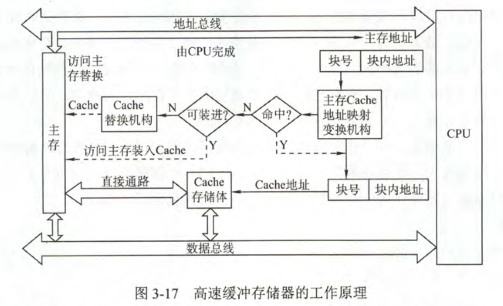

Cache通常由SRAM构成，Cache和主存都被分为若干大小相等的块，**Cache与主存间的交换是以块为单位的**。Cache速度比主存高的多，所以也贵很多，从而Cache容量也比主存小很多。

每当CPU要访问主存时，会**给出主存某存储单元的地址**，检查Cache中是否含有此访存地址的数据，如果命中，就将此**主存地址转换成Cache地址**，对Cache进行操作；若不命中，则仍需访问主存，并**把此字所在的块一次从主存调入Cache内**，如果Cache满，则根据某种替换算法，替换掉Cache中原来的某块信息。

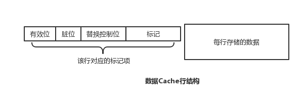

Cache每行分为**标记项**和每行**存储数据**两部分，不同的Cache映射方式Cache的标记项是不同的。但一般含有以下几种：

- **有效位**：表示Cache映射的主存块数据是否有效
- **标记**：说明它是主存中哪一块的副本
- 脏位（一致性维护位）：对Cache内的数据执行写操作时，如果采用 Write-Back 策略，可能会导致Cache内数据和主存数据的不一致，所以设置1位脏位表明数据是否被修改过。
- 替换控制位：当需要对Cache块进行置换时，需要一定的算法。

ps：有效位和标记位是必有的，具体题目要根据题目给出的条件分析Cache标记字段到底有多长。

#### Cache与主存的映射方式

地址变换：当CPU给出一个主存地址时，地址映射机制要能按照一定的规则转换为Cache地址；

Cache地址映射指的是**把主存地址空间映射到Cache地址空间**，也就是通过规定一种方式，把主存中的部分数据块放到Cache内，还要把该主存块的地址，经过某种函数关系处理后写进Cache标记字段。

这样在映射方式给出后，CPU便可以通过规定的映射方式，将主存地址转化为Cache地址从而查找Cache内的数据。

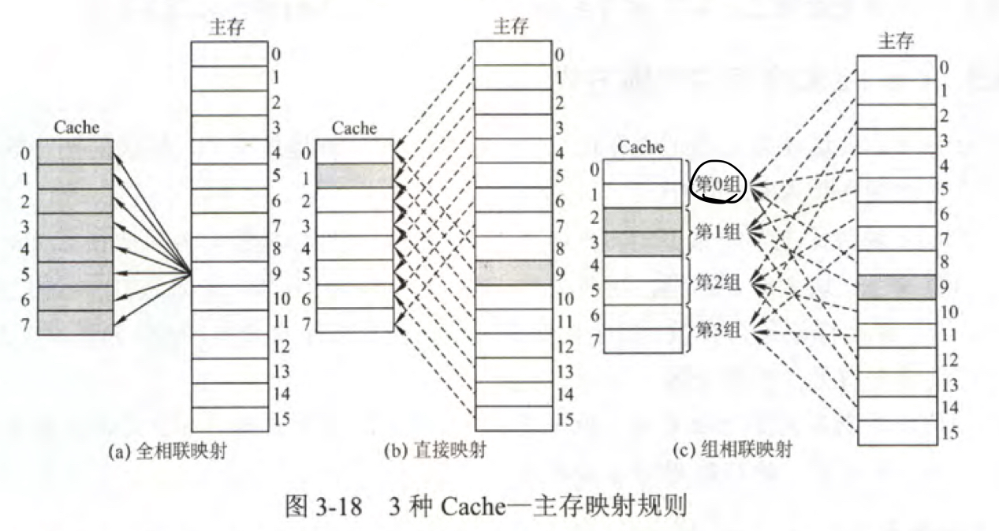

- 直接映射：主存中的某块数据块只能装入到Cache中的某一个位置。
  - 主存地址结构：`主存字块标记 + Cache块地址 + 块内地址`
    - 块内偏移：表明这个主存单元在块里面的位置
    - Cache块号：表明这个主存单元所在的块对应Cache中的哪一块
    - 主存字块标记：表明此Cache块对应的主存哪块
  - 本质上就是对号入座，把主存根据Cache的块数进行分段，每段都按号入座。所以查找效率极高，只要给一个主存地址，立刻就可以找到对应的Cache块，从而查看Cache行内的标记与给出的主存标记是否一致。
- 全相联映射：主存数据块可以转入到Cache中的任何位置。
  - 主存地址结构：`主存字块标记 + 字块内地址`
  - 当要查看某主存单元是否存在与Cache中时，需要从头遍历Cache块，所以就算此主存块位于Cache中时，地址变换速度较慢。
- 多路组相连映射：把Cache分为大小相同的组，组间采用直接映射，组内采用全相联映射。
  - 主存地址结构：`主存字块标记 + 组地址 + 字块内地址`
  - 地址变换时，根据主存地址得到组号，在Cache组内遍历查找与主存标记字段一致的数据块，如果有则命中。

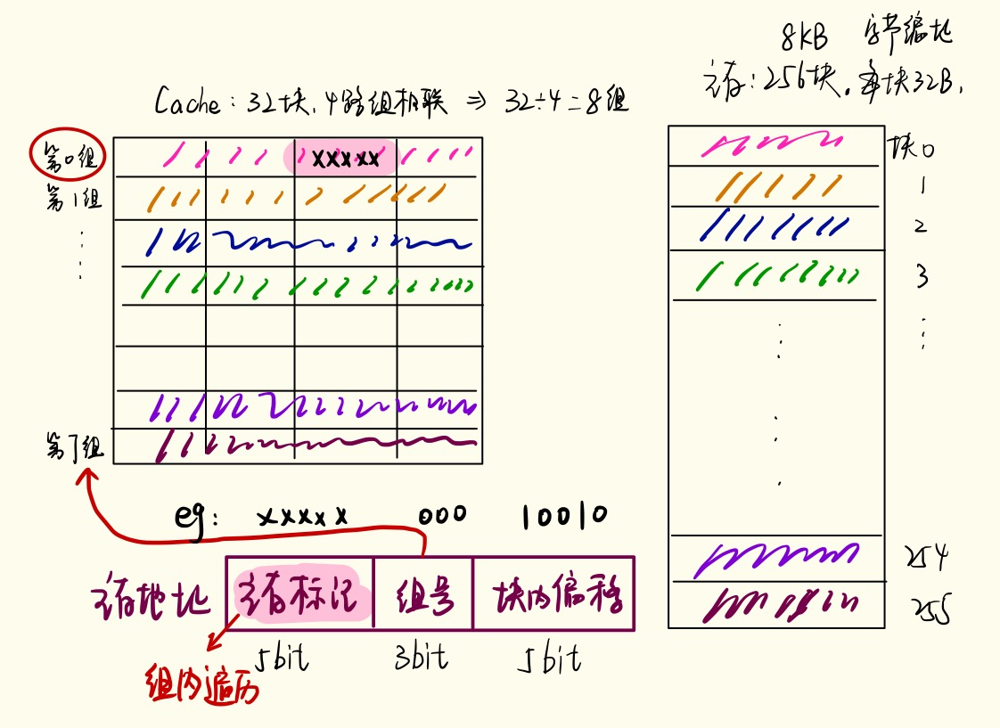

#### Cache写策略

Cache中的内容本质是主存块副本，所以当对Cache中的内容更新时，需要选用写操作策略使Cache与主存中的内容保持一致。

- CPU对Cache写命中时
  - Write-Through（全写法，写直通法）：写Cache同时对主存一起更新。这种方法不需要一致性维护位。
  - Write-Back（写回法）：CPU对Cache写命中时，只修改Cache的内容，在Cache被替换时才写回主存。
- CPU对Cache写不命中时
  - Write-Allocation（写分配法）：加载主存块到Cache中，然后更新Cache块，常和 Write-Through搭配使用。
  - not-Write-Allocation（非写分配法）：只写入主存，不需要调块，与Write-Back搭配使用。

现代计算机设立多级Cache，离CPU越近的Cache速度越高，所以采用Write-Through需要的时间也不会很多，最后一级靠近主存的Cache，通常都采用Write-Back，如果每次对Cache的修改都需要同时改主存的话，如果频繁修改就会造成写缓冲饱和而溢出，因为主存修改速度太慢了。

### 主存管理

#### 概述

***程序的装入和链接***

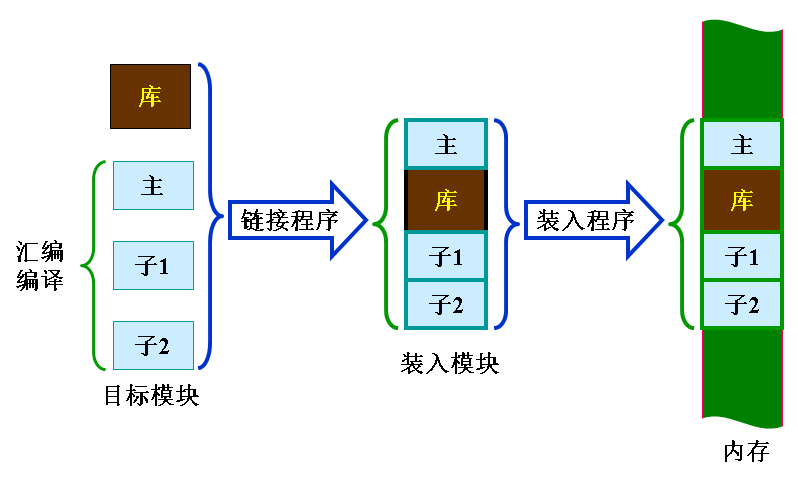

- 逻辑地址：用户编程时用到的地址空间
  - 不同程序的相同逻辑地址会映射到主存的不同位置
- 物理地址：实际的内存地址
- 重定位：把程序装入内存时修改程序中所有与地址有关的项，也就是**逻辑地址变换为物理地址**。

- 编译：编译程序将用户源代码编译成若干个目标模块
- 链接：链接程序将编译后的一组**目标模块**以及所需的**系统调用模块（库函数）**链接在一起，形成一个完整的**装入模块**
  - 静态链接：在程序运行之前，将各目标模块以及它们所需的库函数链接成一个完整的可执行程序，以后不再拆开；
  - 动态链接：装入内存时，边装入边链接
  - 运行时动态链接：在程序执行中需要该目标模块时，才对它进行链接。
- 装入：装入程序将装入模块装入内存运行
  - 绝对装入：程序中的逻辑地址与实际内存地址完全相同。
  - 可重定位装入（静态重定位）：作业**装入内存时**进行地址转换，一次性分配足够内存，内存不够则不能装入；作业一旦进入内存后，在整个运行期间不能在内存中移动，也不能再申请空间。
  - 动态运行时装入（动态重定位）：**程序执行时**进行地址转换，需要设置**重定位寄存器**。

***内存保护***

在内存分配时，需要保护操纵系统不受不受用户进程的影响，也要保护不同进程之间不受干扰，可以采用两种方法：

- CPU中设置上、下限寄存器，存放用户作业在主存中的下限和上限地址；CPU访问某主存单元时，分别与两寄存器的值相比判断有无越界。
- 采用重定位寄存器（基址寄存器BX）和界地址寄存器（限长寄存器）：每个**逻辑值先与界地址寄存器比较**，未越界的话就**与重定位寄存器的值相加**产生物理地址再送至内存单元。
  - 重定位寄存器：最小的物理地址值
  - 界地址寄存器：逻辑地址的最大值
    - 两寄存器的初始化在CPU调度程序时初始化

**覆盖** （远古时代）：将**用户空间分为固定区和覆盖区**，活跃部分放在固定区，内存中只能更新覆盖区的段。首先将即将要访问的段放入覆盖区，其他段放在内存中，需要调用时，才将其调入覆盖区替换其原有的段。

**交换** ：把内存中暂时不能运行的进程或者暂时不用的程序和数据调出到外存上，腾出空间后，把已具备运行条件的进程或进程所需要的程序和数据调入内存。

交换技术主要在**不同进程（或作业）之间**进行，而覆盖则用于**同一程序或进程**间。

#### 连续分配管理方式

- 单一连续分配：内存分为系统区和用户区。系统区通常在低址部分，其他全是用户区。

  - 只用于单用户单任务操作系统
  - 无需存储保护

- 固定分区分配：内存的用户空间划分为若干个固定大小的区域，每个分区只允许装入一道程序。

  - 允许多个分区并发执行；
  - 当有空闲分区时从外存后备队列选择适当大小的作业进入内存。
  - 划分分区的方法
    - 分区大小相等：死板
    - 分区大小不等：满足不同作业的需求
  - 内存分配
    - 采用分区使用表；
    - 分区按大小排队；
    - 由内存分配程序检索分区使用表，找到合适的分区。
  - 因为分区是固定大小的，当程序小于分区大小时，会产生**内部碎片**。

- 动态分区分配：根据进程大小动态分配内存空间

  - 已占用区和空闲分区并不绝对
  - 必须用某种数据结构记录分区的情况
  - 程序进入内存必须分配空闲分区、装入程序并修改相应数据结构
  - 进程被装入时需要重定位

  ***数据结构***

  - 空闲分区表

  

  - 空闲分区链：双向链表

  

  ***分区分配操作***

  1. 分配内存
     - m.size：空闲分区大小
     - u.size：请求的分区大小

  

  1. 回收内存
     - 回收区*与插入点的前一个空闲分区相邻接*：合并，修改前一分区大小
     - *与插入点的后一个空闲分区相邻*接：合并，回收区首地址作为新空闲去首址，大小为`回收区+F2`
     - *与插入点的前后两个空闲分区相邻接*：三个合并，首址为前空闲分区首地址，大小为`F1+回收区大小+F2`
     - *不与任何一个相邻接*：增加新的表项

  

##### 基于顺序搜索的动态分区分配算法

  ***首次适应算法***：从头开始找，第一个能找到的能放下的空闲分区，分割。

  ***循环首次适应算法***：从上次找到的空闲分区的下一个空闲分区开始查找，如果最后一个不能满足要求，返回到第一个空闲分区。

  以上两种空闲分区都是按照*地址递增*的顺序排列

  ***最佳适应算法***：分区按照大小由小到大排列，找到第一次满足要求的空闲分区，分割。会导致碎片非常小，难以利用。

  ***最坏适应算法***：每次分配最大的空闲分区，分割后的空闲分区会比较大.

##### 基于索引搜索的动态分区分配算法

  ***快速适应算法***：又称分类搜索法，对每一类具有相同容量的所有空闲分区设立`空闲分区链表`，	同时在内存中设立一张`管理索引表`。

  *算法思想*：根据进程长度找到能容纳它们的最小空闲区链表，分配第一块即可。

#### 离散分配方式

***基本分页存储管理方式***

把主存空间划分为大小相等且固定的块，块相对较小，作为主存的基本单位。每个进程以块为单位进行划分，进程在执行时以块为单位逐个申请主存中的块空间。

分页形式上与固定分区分配相似，但固定分区是为每个作业分配一个连续的分区，而分页是为作业分配很多个页面，页面比分区小的多得多。但进程的最后一个页面很可能会占不满页面，这就形成了内部碎片。

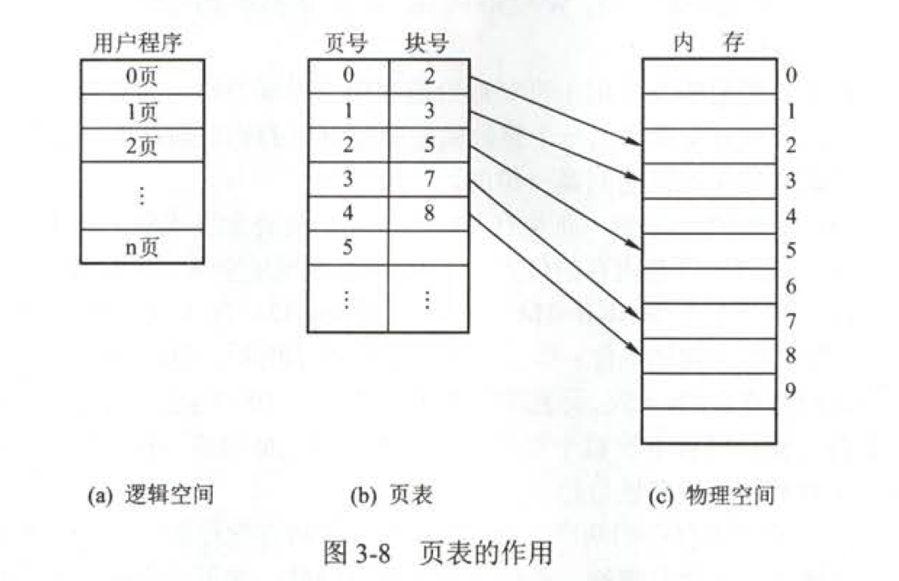

- 页面的三种形式
  - 页（逻辑）：进程中的块
  - 页框（物理）：内存中的块
  - 块（外存）：外存中的块
- 逻辑地址结构：`页号+页内偏移`
- 页表：系统为每个进程建立一张页表，记录页面在内存中对应的物理块号。

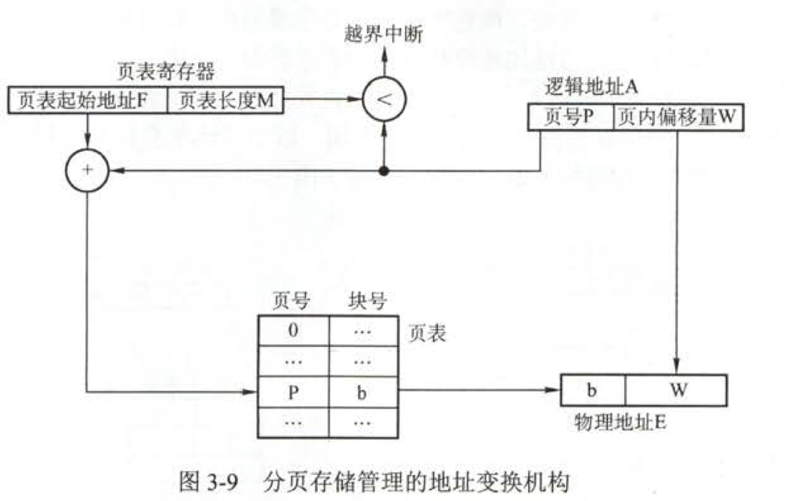题目给出一个逻辑地址，根据题目中给出的页面大小可以计算出逻辑地址结构中的页内偏移所占bit，从而得出页号。根据页号查页表，得到对应逻辑页号的物理块号，再加上页内偏移地址就可得出物理地址。

注意：每次访存操作都需要进行逻辑地址到物理地址的转换，转换过程必须足够快，否则访存效率会较低；**页表不能太大，否则内存利用率会降低**。

**快表TLB** ：具有并行查找能力的高速缓冲存储器，存放当前访问的若干页表项。快表是联想寄存器，可以实现按内容查找。

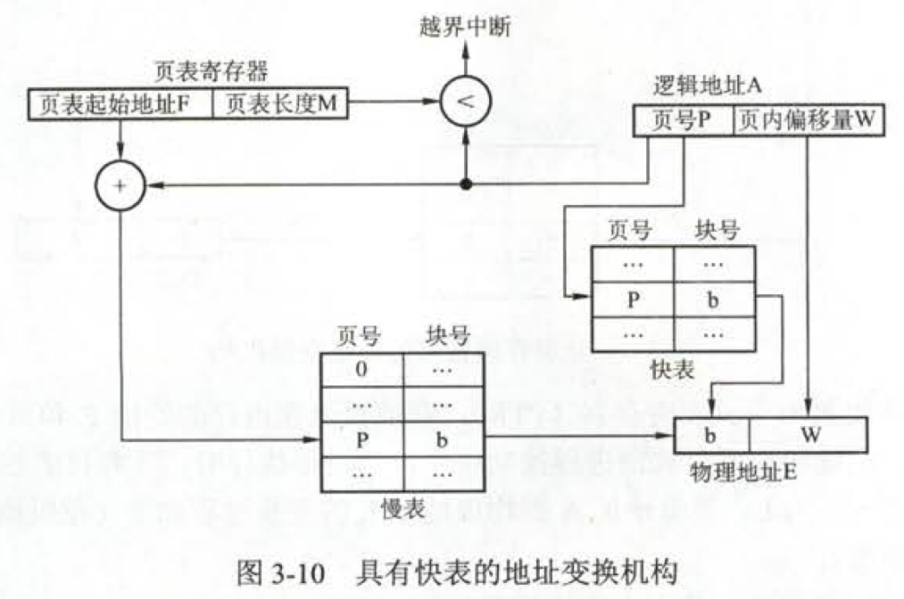

引入快表之后，如果在快表中存在逻辑页号对应的页表项，那么存取数据只需要访问 1次内存就可以实现。如果没有找到，则需要访问主存中的页表，在读出页表项之后，同时将其存入快表，所以还是需要2次内存访问，1次查页表，1次访问内存单元。

**多级页表**

实际上就是在原有页表结构上再加了若干层页表，顶级页表中存的不再是数据，而是二级页表的地址，等等以此递推。

ps：顶级页表最多只能有 1 个页面；n级页表每次访问某页需要那n+1次访存。

***基本分段存储管理方式***

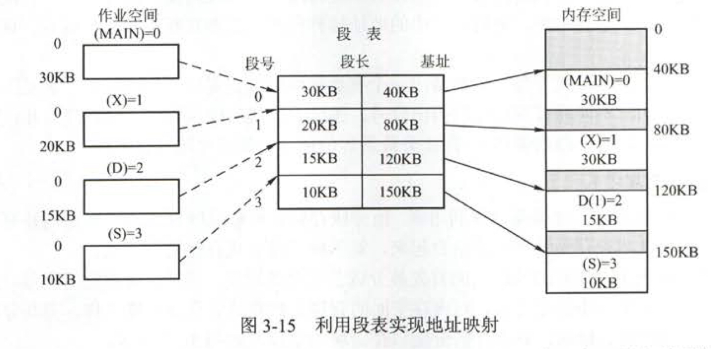

- 分段：按照用户进程中的自然段划分逻辑空间，段内要求连续，段间不要求连续。
  - 逻辑地址结构：`段号 + 段内偏移`
- 段表：每个进程有一张自己的逻辑空间与内存空间映射的段表。
  - 段表项：`段号 + 段长 + 本段在主存中的起始地址`

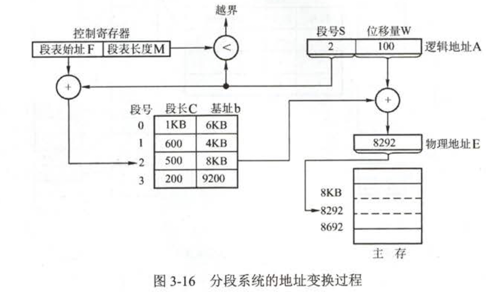

1. 从逻辑地址中取出前几位段号；
2. 比较段号和段表长度，如果段号 > 段表长度，产生越界中断；
3. 比较段表中的对应段的段长和逻辑地址中的段内偏移，如果逻辑地址中的段内偏移 > 段长，产生越界中断；
4. 段表基址 + 段内偏移生成主存地址

**段页式管理方式**：每个进程建立一张段表，每段有一张页表。

### 虚拟存储器

虚拟内存中允许将一个作业分多次调入内存，所以必须 建立在离散分配的内存管理之上。

请求分页管理方式是基本分页管理方式进化体。在请求分页系统中，必然会出现要访问的页面不再内存的情况，所以请求页表项字段为 `页号 + 物理块号 + 状态位 + 访问字段 + 修改位 + 外存地址`。

缺页中断与一般中断相比有以下两个区别：

- 缺页中断属于内中断（异常），指令执行期间产生和处理中断信号；
- 一条指令在执行期间可能会产生多次缺页中断。

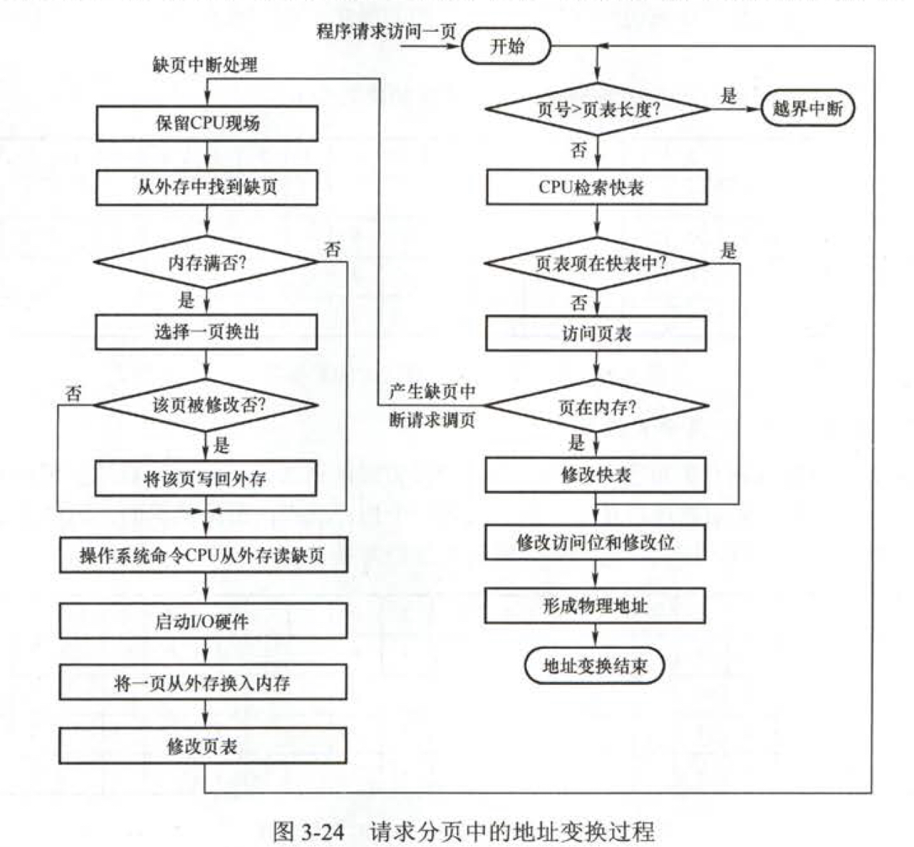

#### 页面置换算法（略）

#### 页面分配策略

驻留集：在某段时间间隔内，**进程要访问的页面的集合**。让操作系统跟踪每个进程的驻留集，并为进程分配大于其驻留集的物理块。如果还有空闲物理块，则可以再调一个进程到内存以增加多道程序数；如果所有驻留集之和超过了可用物理块的总数，那么操作系统会暂停一个进程，将其页面调出并将物理块分配给其他进程。

- 抖动：页面置换过程中，刚刚调出的页面马上又要换入内存。
  - 主要原因：**进程频繁访问的页面数目高于可用的物理页帧数**。
  - 现象：硬盘繁忙（说明一直处理缺页中断）
  - 解决方案：
    - 在内存中保留更多的进程以提高系统效率
    - 撤销部分进程从而减少要用到的页面数
- 固定分配局部置换：每个进程分配固定数目的物理块，运行期间不变；若运行期间缺页，从进程在内存中的页面中选出一页置换；
- 可变分配局部置换
- 可变分配全局置换：系统中每个进程分配一定数目的物理块，操作系统自身保持一个空闲物理块队列。当缺页 时，系统从空闲物理块队列中取出1块分配给该进程，并将欲调入的页面装入其中。

请求分页系统中外存分为文件区和对换区。若交换空间利用率异常高，而CPU利用率及硬盘繁忙率正常，即作业不多交换情况却频繁，立即推物理内存严重短缺。

#### 从虚拟地址到Cache查找内容

给出一个虚拟地址，首先应该**根据请求分页地址变换过程得到物理地址**；然后**根据物理地址到data Cache中访问数据**，若**不命中，再到主存中访问该存储单元**。

请深刻理解王道操作系统P184页从一个虚地址到访问数据时如何操作的例题。

### 磁盘组织与管理

#### 概念与计算

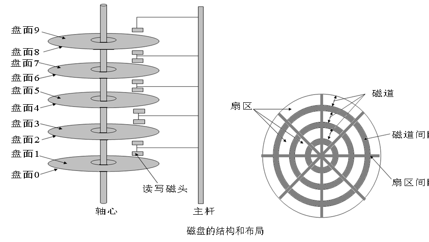

PS：所有盘片上相对位置相同的磁道组成柱面。扇区是磁盘可寻址的最小存储单位，磁盘地址用柱面号 + 盘面好 + 扇区号表示。

**磁盘计算题**

- 寻找时间Ts：把磁头移动到指定道所需要的时间（***mn***）+ 启动磁臂的时间（***s***）。
- 延迟时间Tr：磁头定位到某一扇区所需要的时间 ***Tr = 1 /2r***，r为磁盘旋转一周所需要的时间。
- 传输时间Tt：取决于读写的字节数和磁盘旋转速度。***Tt = b / rN***，b为每次读写字节数，r*N为单位时间内磁盘的数据传输率，也就是单位时间转多少转 * 一个磁道上的字节数。

注意：磁盘是自转设备，有些题目在每读完一个扇区需要数据处理时间，在处理的时间中，磁头还是在向前运动，所以要根据具体问题具体分析，当处理结束后，磁头位于哪个扇区，要读的扇区又在哪。

- 逻辑记录在盘面上按扇区交替编号连续存放可以减少 磁头的延迟时间。
- 同柱面不同盘面的扇区错位编号，连续读写两个不同盘面的逻辑记录可以通过减少寻道时间从而减少读写时间。

#### 磁盘调度算法

- FCFS
- SSTF：会产生饥饿现象；
- SCAN：在磁头当前移动方向上选择与当前磁头所在磁道距离最近的请求作为下次服务对象；需要走到边缘磁道，最后一次不需要。
- C-SCAN：磁头单向移动，回返时直接快速移动至起始端而不服务任何请求（必须要访问到磁道最外端和最里端）。
- LOOK：不需到达磁盘端点的SCAN
- C-LOOK：不需到达磁盘端点的C-SCAN

PS：不特别说明默认SCAN和S-CSAN为LOOK和C-LOOK。

#### 磁盘管理

1. 初始化
   1. 低级初始化：将磁盘分成扇区以便磁盘控制器能进行读写操作；
   2. 将磁盘分为一个或多个柱面组成的分区；
   3. 对物理分区进行逻辑格式化
2. 引导块
3. 坏块：对坏块的处理实际上是采用某种机制，使系统不去使用坏块。硬件故障操作系统无法修复。
   - 扇区备用：用备用块替代逻辑坏块。

**磁盘高速缓存（Disk Cache）** ：利用内存中的存储空间来暂存从磁盘读出的一系列盘块中的信息。逻辑上属于磁盘，物理上是驻留在内存中的盘块。

--------------------------

参考资料：《王道2019考研计算机组成原理》、《王道2019考研操作系统》

