【考查目标】

1. 理解单处理器计算机系统中各部件的内部工作原理、组成结构以及相互连接方式，具有完整的计算机系统的整机概念。
2. 理解计算机系统层次化结构概念，熟悉硬件与软件之间的界面，掌握指令集体系结构的基本知识和基本实现方法。
3. 能够综合运用计算机组成的基本原理和基本方法，对有关计算机硬件系统中的理论和实际问题进行计算、分析，对一些基本部件进行简单设计;并能对高级程序设计语言(如C语言)中的相关问题进行分析。

本人才疏学浅，如有错误，欢迎指正。

## 计算机系统概述

### 计算机发展历程

第一台电子数字计算机：ENIAC (Electronic Numerical Integrator And Computer)

摩尔定律：价格不变时，集成电路上可容纳的晶体管数目约 18 个月会增加一倍。18个月后同样的钱可以买到性能是现在性能两倍的cpu。

计算机分类：
- 单指令流和单数据流系统（传统冯•诺伊曼结构）
- 单指令流和多数据流系统（向量处理系统）
- 多指令流和单数据流系统（不存在的）
- 多指令流和多数据流（多处理器系统）

计算机发展两极化：更小和更大。

### 计算机系统层次结构

#### 计算机系统的基本组成及软硬件关系

计算机系统：软件系统和硬件系统。两者在逻辑上等效（并不等价），同一功能硬件实现效率更高。

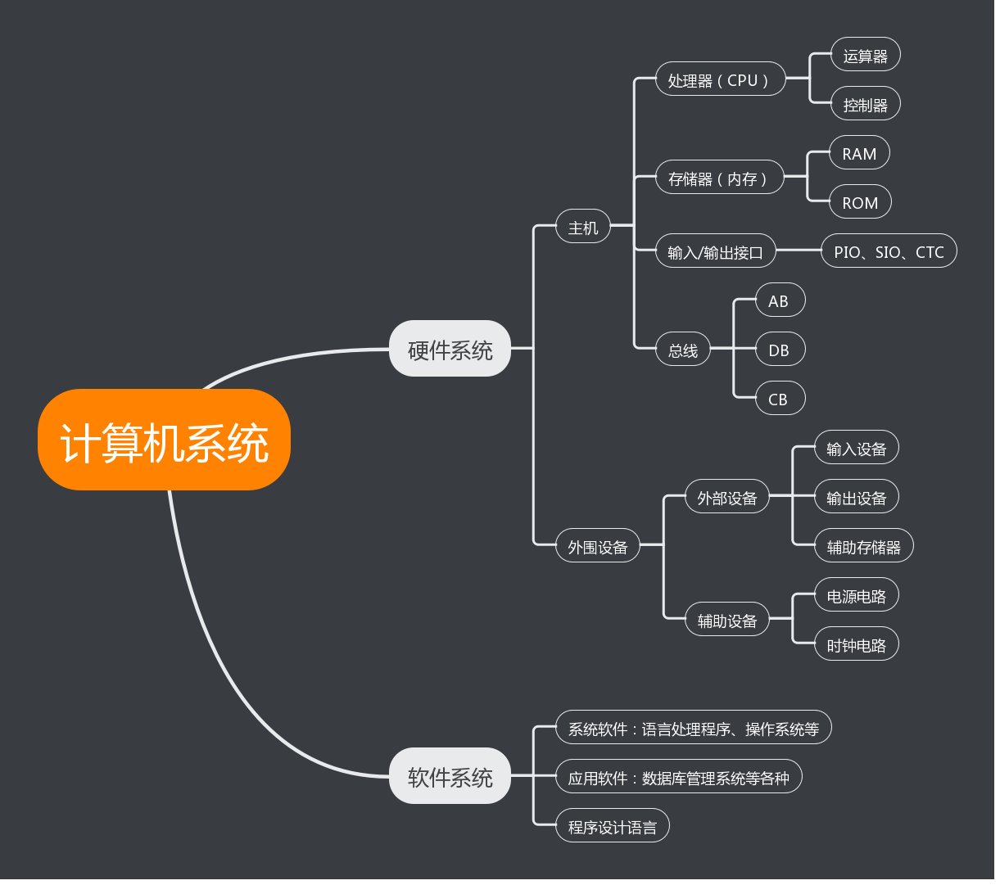

计算机系统分层结构如下图所示：

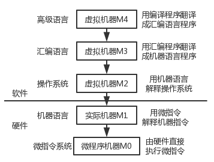

计算机硬件的基本组成

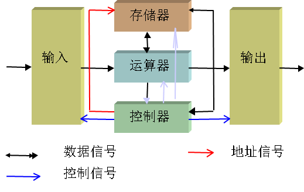

显然，冯诺伊曼计算机是指令执行的计算机系统，故其基本工作方式为控制流（指令流）驱动方式。

- 存储器
    - 存储字长：存储单元存储的二进制位数
    - 主存储器
        - MAR：用于**寻址**，位数与存储单元个数对应。长度与PC长度相等
        - MDR：长度与存储字长相等，即数据线的位数
          ps：现代计算机中MAR和MDR位于CPU中
    - 辅助存储器
- 运算器：算术运算和逻辑运算
    - Arithmetic Logical Unit ：算术逻辑单元
    - 通用寄存器：暂存操作数和中间结果，ACC、MQ、X、IX、BX等
    - 程序状态寄存器PSW
  - 控制器：指挥其他部件工作
      - PC：存放下一条执行的指令地址，取指后自增。
      - IR：存放当前执行的指令
      - CU：控制单元用来发出各种控制信号。

现代计算机：CPU=运算器+控制器

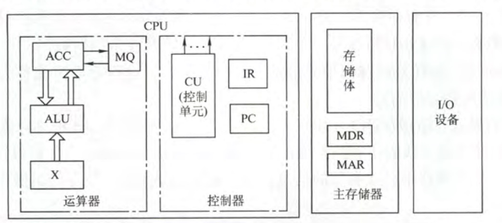

#### 计算机工作过程

1. 程序和数据装入主存
2. 从程序的起始地址运行程序
3. 从首地址取指、译指、运行，完成这条指令后并计算下一条指令的地址
4. 用新得到的指令地址继续取指、译指、执行直到程序结束为止。

### 计算机性能指标

- 吞吐量：单位时间内处理请求的数量。
- 响应时间：用户发送一个请求，系统对该请求作出响应并完成结果的时间。

- CPU时钟周期：CPU的节拍脉冲，是CPU中最小的时间单位。
- 主频（CPU时钟频率）：通俗一点就是单位时间有多少个时钟周期。
- CPI：执行一条指令所需的时钟周期数。这个属性是由硬件决定的，每个CPU在出厂时就已经决定了他的CPI，同一个CPU的CPI相等。而题目中给我们一段程序并提供指令比例和每条指令的CPI，让我们计算的是某段程序的平均CPI，所以如果通过执行不同的程序来测CPI的话，测得的计算机CPI可能是不同的。

- MIPS：Million Instructions Per Second。每秒执行多少百万条指令 也就是用主频除以CPI
- MFLOPS：MIllion Floating-point Operations Per Second，每秒执行多少百万次浮点运算，这个指标最适合用于科学计算的计算机中。

- 机器字长：计算机一次能处理的二进制位数。32bit计算机也就是一次能处理 32bit信息，一般等于内部寄存器的大小。
- 存储字长：主存每个存储单元存储的二进制 bit 数。**必须是字节的整数倍**。
- 指令字长：一条指令包含的二进制 bit 数。**长度一般取存储字长的整数倍方便存取**，如果指令字长取存储字长的2倍，那么取一条指令需要2次访存，即取指周期为存取周期的二倍。

**IR、MAR、MDR对任何程序猿都透明。**

## 数据的表示和运算

### 数制与编码

进制转换（略）

真值和机器数（略）

#### Binary-Coded Decimal ：二进制编码的十进制数

- 8421码: 有权码。4bit ，每位的权值分别是8、4、2、1。它本质上还是十进制数，所以当两个8421码相加和大于9时需要修正一下，进位。
字符与字符串（略）

#### 校验码

1. 奇偶校验码
2. 海明校验码
3. CRC冗余校验

  [参考此博客](https://www.cnblogs.com/VersionP1/p/7779251.html)

### 定点数的表示和运算

### 定点数

> 公式无法正常显示，转[简书](https://www.jianshu.com/p/62a2c2360d5a)

定点数：计算机中约定机器数小数点位置，小数点的位置固定的数。

- 定点整数：小数点位置约定在最低位之后
- 定点小数：小数点位置约定在最高位之后

| 编码方式                                                     | 取值范围（n 位机器数，n从 0 开始数） | 最大值（以 8 位机器数为例）                 | 最小值                                     |
| ------------------------------------------------------------ | ------------------------------------ | ------------------------------------------- | ------------------------------------------ |
| 原码：最高位符号位，数据位为 2 进制真值                      | $ \ -2^{n} + 1$ ~ $ 2^{n} -1 $       | 符号位取 0 ，数据位全 1 。`0111 1111` : 127 | 符号位取 1，数据位全 1。`1111 1111` : -127 |
| 反码：最高位为符号位，数据位为原码取反                       | $ \ -2^{n} + 1$~ $ 2^{n} -1 $        | `0111 1111` : 127                           | `1000 0000`: -127                          |
| 补码：反码值 + 1 。权值公式为$-2^nx_n + \sum_{i=0}^{n-1}2^ix_i$ | $ \ -2^{n} $~ $ 2^{n} -1 $           | `0111 1111` : 127                           | `1000 0000` -128                           |
| 移码：补码符号位取反。                                       | $ \ -2^{n} $~ $ 2^{n} -1 $           | `1111 1111` : 127                           | `0000 0000`: -128                          |

注：无符号数的编码具有唯一性。**有符号数正数的原码、反码、补码相同**，移码与补码符号位相反。

#### 运算

##### 移位运算

* 算数移位：**左移一次为乘 2 ，右移一次为除以 2** 。
  * 算数移位的对象是带符号数，移位过程中符号位不变。
  * **正数移位直接添 0 ，负数原码反码移位直接添 0 ，补码左移添 0 ，右移添 1** 。

- 逻辑移位：添 0 
- 循环移位：带进位与不带进位的意思是数据位移动的时候带不带 CF 标志位。
  - 不带进位的循环移位：因移动而丢失掉的数据位要存储到 CF 标志位中。CF 标志位不参与循环。

##### 定点数加减运算溢出判断

溢出：运算结果超过机器可以表示的数。ps：产生进位并不等于溢出。

* 1 位符号位：两操作数符号同，结果与操作数符号不同，则溢出。
* 2 位符号位：运算结果符号位 S1 异或 S2，结果为 1 则溢出。
  * 01：正溢出
  * 10：负溢出
  * 00：结果为正数，无溢出
  * 11：结果为负数，无溢出
* 数据位最高位进位情况：与符号位进位不同则溢出。

#### 强制类型转换

C 语言中的类型转换结果保持机器数位值不变，只是改变了解释这些位的方式。

* **大字长变量向小字长变量**转换时**直接截断高位部分**
* 小字长变量向大字长变量转换时**保持低位不变，高位扩展为原数字的符号位**

### 浮点数

浮点数：小数点位置可变的数。 $ N = r^E \times M \text{, 浮点数格式定义。其中 M 为尾数，E 为阶数，r 为基数。} $

***IEEE 754标准***

$$
V = (-1)^S \times 1.M\times 2^{E-e} \text{,IEEE 754标准的浮点数真值}
$$

| 类型         | 数符 | 阶码 | 尾数 | 总位数 | 偏移量e |
| ------------ | ---- | ---- | ---- | ------ | ------- |
| 单精度浮点数 | 1    | 8    | 23   | 32     | 7FH     |
| 双精度浮点数 | 1    | 11   | 52   | 64     | 3FFH    |
| 临时浮点数   | 1    | 15   | 64   | 80     | 3FFFH   |

注：**单精度与双精度浮点数采用隐藏尾数最高位策略**，数据的最高位总是 1 ，隐藏最高位可以使尾数多表示 1 位有效位。

#### 浮点数的加减运算

##### 1. 规格化两操作数

为了提高运算精度，规定尾数的最高位数必须是一个有效值。

- 单符号位规格化
  - 原码规格化后尾数**数据位最高位**为 1
  - 补码规格化后正数与原码同，负数数据位最高位为 0 ，形如  `1.0XXX XX..`
- 双符号位规格化
  - 正数：`00.1XXX XX..`
  - 负数：`11.0XXX XX..`

- 左规：尾数左移（小数点右移），阶数减小
- 右规：尾数右移（小数点左移），阶数增大

ps：基数不同时，浮点数的规格化形式也不同。当基数为 4 时，浮点数尾数最高两位不全为 0；基数为 8 时，位数最高三位不全为 0。

##### 2.  对阶

使两操作数阶数相等，**小阶向大阶对齐**，阶数增大尾数右移。

##### 3. 尾数求和后规格化结果值

##### 4. 舍入

对阶和右规过程中，尾数低位可能会丢失引起误差。

- 0 舍 1 入法：尾数右移时被舍去的最高数值位为 0 则舍去；被舍去的最高数值位为 1 则在尾数的末位 +1
- 恒置 1 
- 最简单的舍入方法是直接截断不做处理

##### 浮点数溢出判断：阶码是否超过取值范围。

下溢时仅当作机器 0 处理，上溢时计算机必须中断运算操作并进行溢出处理。

## 存储器

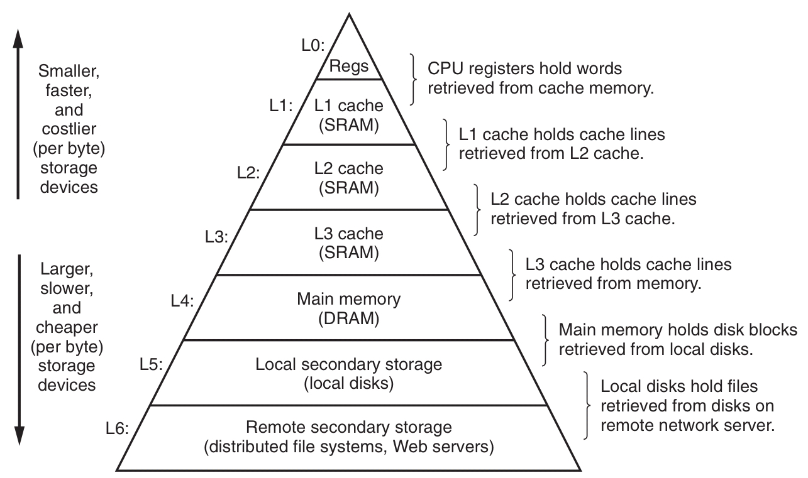

常识：CPU-Cache-主存-辅助存储器构成计算机的三级存储系统

### 半导体随机存储器

#### SRAM：静态随机存储器
- 工作原理：触发器，所以即使信息被读出也不需要再生。
- 存取速度相比DRAM更快，所以价格贵得多，一般用来做cache
- 地址线引脚数：贵而且容量相对小，所以地址不需要分两次传，一次就行。

#### DRAM：动态随机存储器

- 工作原理：电容电荷存储信息。初中生都知道电容上的电荷只能维持一段时间，所以不需要读取，DRAM上的信息自己就消失了，所以每隔一段时间需要**刷新**。
- 价格相对SRAM较低，需要刷新，一般用来做主存
- 主存地址单元的个数就相对非常多了，所以DRAM采用了地址复用技术，地址线时原来的二分之一，而且地址信号分行、列两次传送

> - 集中刷新：利用一段固定时间依次对存储器的所有进行逐一再生，期间禁止对存储器的读写操作。
> - 分散刷新：把对每一行的刷新分散到各个工作周期，前一半正常读写，有一半用来刷新某一行，所以如果计算机的存取周期是芯片的存取周期二倍。
> - 异步刷新：将刷新周期除以行数得到两次刷新之间的时间间隔t，每隔t刷新一次。这样可以避免延长存取周期，也大大缩小了死时间。

#### ROM：只读存储器

ROM也是随机读取的存储器，信息一旦写入就固定不变了，即使断电也不会丢失，所以通常使用ROM存放一些固定不变的程序和数据，还有操作系统的固化。**RAM和ROM共同组成计算机主存的一部分**。

- MROM：不可改变
- PROM：一次可编程
- EPROM：可擦除可编程。可以把ROM中原来的数据全部擦掉再重新写。虽然它可读又可写，但绝对不可以替代RAM，因为写的速度很慢。
- FLASH Memory：可以在不加电的情况下长期保存信息，U盘就是用的flash芯片。
- Solid Memory：基于闪存的固态硬盘由控制单元和存储单元（FLASH）组成，速度快，功耗低，但是贵。

### 主存储器和CPU的连接

考试一般不会让画图，但是地址空间，字扩展、位扩展、字位扩展、芯片选择要会。

#### 双口RAM

双口RAM：有左、右两个独立的端口，分别具有两组相互独立的地址线、数据线和读写控制线，允许两个独立的控制器同时异步地访问存储单元。

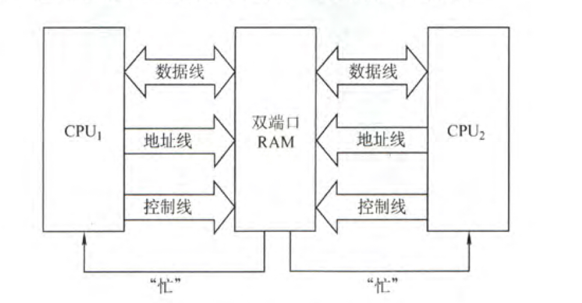

当两个端口访问同一地址单元时，不可以同时对一个地址单元写入，会出现写入错误；也不可以两个端口一个在写一个读，会出现读出错误。

#### 多模块存储器

1. 单体多字存储器：一个存储体，每个存储单元可以存放n个字，同样总线宽度也是n个字。

2. 多体并行存储器

   1. 高位交叉编址：主存地址结构分为体号和体内地址两部分，它依然是顺序存储器！

   2. **低位交叉编织** ：主存地址结构低位为体号，高位位体内地址。程序连续存放在相邻体中，所以多体可以用流水线的方式并行存取。连续存取m个字所需的时间为 
      $$
      t = T + (m-1)r		 {\text{，T:存取周期 r：总线传输周期}}
      $$
      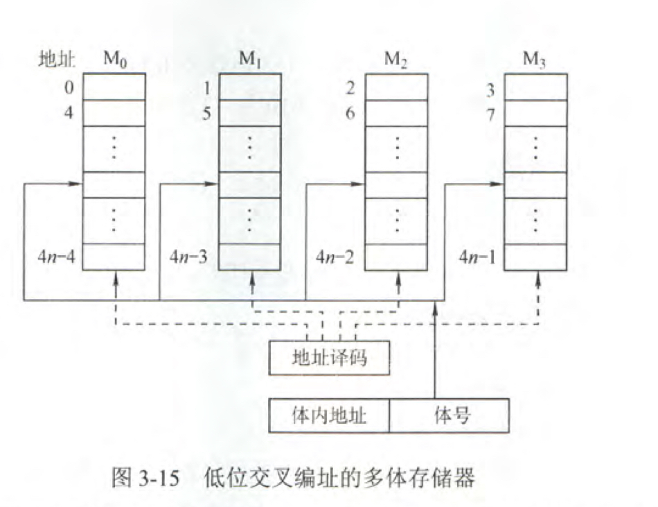

### Cache ：局部性原理

- 时间局部性：现在用到的信息很可能是将来又要用到的，比如循环的判断语句。
- 空间局部性：未来要用到的信息与现在正在放访问的数据在存储空间上是邻近的。

那么我们就可以开辟一小片相对主存教高速的区域，专门用来存放某段时间内需要访问的数据，这就是cache，通常由SRAM构成，位于CPU内部。

着重要搞清楚三种主存地址映射结构、cache标记阵列这里主要是需要练习各种习题深入理解。

## 指令系统

### 指令格式

### 指令寻址方式

- 指令寻址
  - 顺序寻址：pc+1，自动形成下一条指令的地址
  - 跳跃寻址：转移类指令给出的下条指令地址。给出的地址传到PC中，跳跃与否还要受到PSW和操作数的控制。
- 数据寻址
  - 隐含寻址
    - 堆栈计算机中的0地址指令操作数来自栈顶和次栈顶
    - 一地址指令隐含约定目的地址的双操作数指令（规定ACC作为第二操作数的地址）
  - 立即数：无需访存
  - 直接寻址：一次访存
  - 间接寻址：两次访存
  - 寄存器寻址：访问寄存器
  - 寄存器间接：访问寄存器+主存
  - 相对寻址：pc+偏移量再访存
  - 基址寻址：BX+偏移量在访存。面向操作系统，解决程序逻辑空间与存储器物理空间的无关性。
  - 变址寻址：IX+偏移量再访存。面向用户，常用于数组处理，将数组首地址设置为A，不断改变IX的值形成数组中的任意数据的地址。
  - 堆栈寻址：硬堆栈（寄存器）和软堆栈（主存程序划定一段区域）。

### Complex Instruction Set Computer和Reduced Instructions Set Computer

CISC：指令系统复杂庞大，指令长度不固定，寻址方式也很多。各种指令都可以访存，但各种指令的使用频度相差很大，各种指令的执行时间相差也很大。控制器多采用微程序控制，控制器在CPU芯片内所占的面积占百分之50以上，难以优化编译生成高效的目标代码程序。

RISC：选取使用频率最高的一些指令，其余指令的功能由简单指令组合实现；指令长度固定，格式种类较少，寻址方式也少。只有Load和Store指令可以访存，其余指令都在寄存器之间进行，CPU中的寄存器数量很多。采用流水线技术，大部分指令在一个时钟周期内完成；以硬布线控制为主，只占CPU芯片面积的百分之十，重视编译优化工作。

## 中央处理器

### CPU功能和基本结构

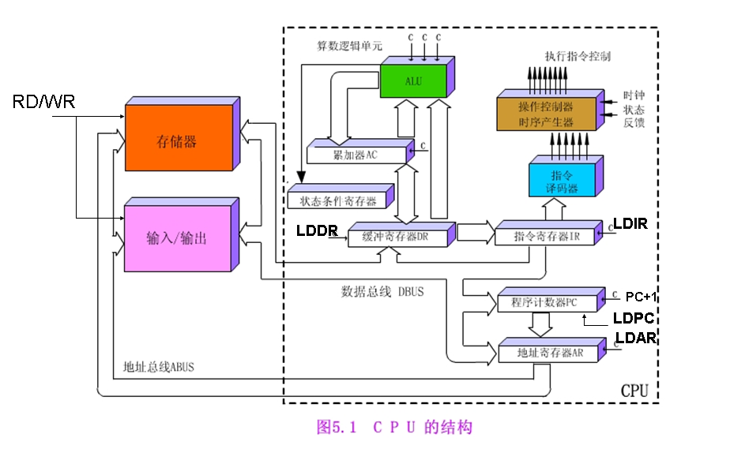

- 运算器：加工数据
  - ALU：算术运算与逻辑运算
  - ACC：暂存ALU的计算结果，也可以作为加法运算的另一个输入端
  - 暂存器：暂存从主存读取到的数据
  - 通用寄存器：存放操作数 
  - PSW：程序状态字寄存器，OF SF PF CF 等标志位
- 控制器：协调并控制计算机各部件执行程序的指令序列
  - PC：存放下一条要执行的指令地址
    - 顺序执行自动 +1
    - 改变程序执行顺序时将下一条要执行的指令地址送到PC
  - IR：存放当前运行的指令地址，执行过程中 IR 内容不变
  - ID：指令译码器，对指令的操作码字段进行译码
  - MAR：存放要访问的主存单元地址
  - MDR：存放向主存写入的数据或者从主存中读出的数据
  - 时序系统：产生各种时序信号，由同一时钟CLOCK分频得到
    - CPU可以根据时序信号辨认从内存中取出的指令还是数据
  - 微操作信号发生器：产生控制整个计算机系统的各种控制信号，结构由组合逻辑型和存储逻辑型两种。

### 指令执行过程

- 指令周期：CPU从主存中取出并执行一条指令所需要的全部时间。
- 机器周期（CPU周期）：在同步控制的机器中，执行指令周期中一步相对完整的操作所需要的时间（指令步）。通常机器周期=主存周期。
- 时钟周期：计算机运行的最小时间单位，也是完成一个微操作所需的时间。

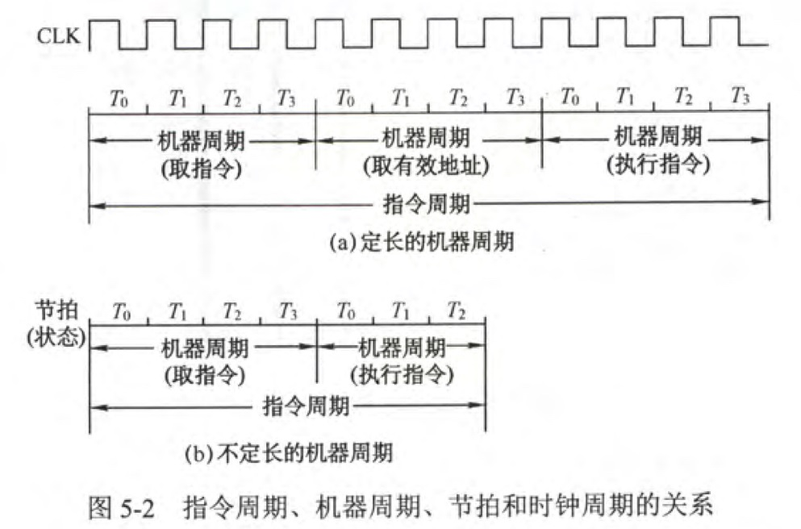

#### 指令周期

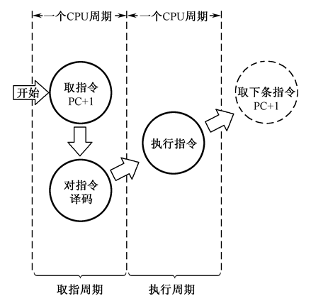

1. 取指周期：PC -> MAR ->  MDR -> IR -> ID，PC+1 -> PC
2. 间址周期（可能没有）：取操作数的有效地址。Ad(IR) -> MAR -> MDR
   1. 如果操作数不需要访问存储器，那么也就不存在间址周期
3. 执行周期
4. 中断周期（可能没有）：处理中断请求。

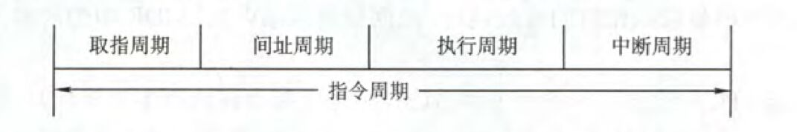

### 数据通路的功能和基本结构

1. 寄存器间数据传送：
   1. PC -> Bus (PC out);
   2. Bus-> MAR (MAR in);
2. 主存与CPU之间的数据传送
   1. PC -> Bus -> MAR ( PC out, MAR in)
   2. 1 -> R (CU)
   3. M(MAR) -> MDR( MDR in)
   4. MDR -> Bus -> IR ( MDR out, IR in)
3. 执行算数或逻辑运算(具体问题具体分析)
   1. Ad(IR) -> Bus -> MAR (MAR out, MDR in) // MDR 中存放的是与IR同样的数据
   2. 1 -> R (CU)
   3. MEM(MAR) -> MDR (MDR in)
   4. MDR -> Bus -> Y (MDR out, Y in)
   5. (ACC) + (Y) -> Z (ACC out, Y out , CU , Z out)
   6. Z -> ACC (Z out , ACC in)

### 控制器

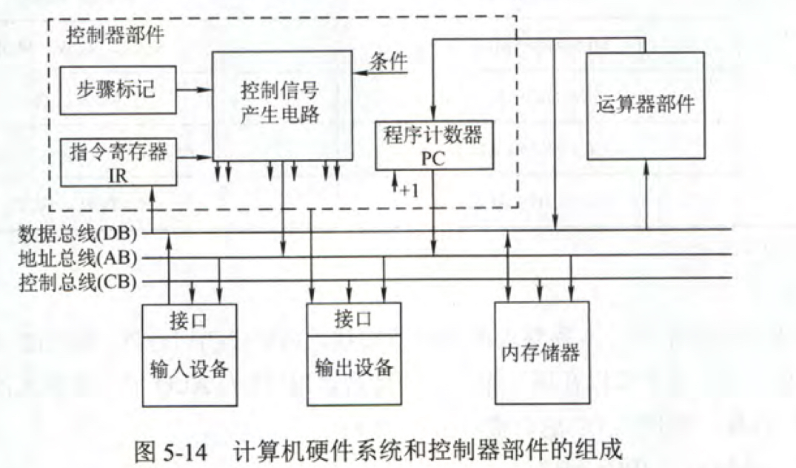

#### 硬布线控制器（组合逻辑电路+触发器）

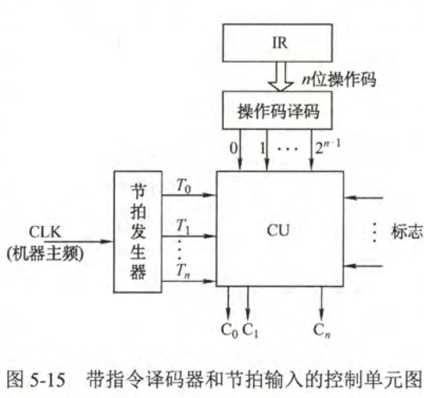

CU的三种输入信息

- IR经过指令译码器向CU输入译码后的操作码字段
- 时序系统产生的机器周期信号和节拍信号
- 来自执行单元的反馈信息，比如进位溢出等信息
- 同时控制单元还要接受一些外来信号比如中断请求、DMA请求等

**CPU的控制方式**：控制每条指令和每个微操作的执行时间

- 同步控制方式：所有的控制信号都来自于系统中一个统一的时钟。通常**以最长的微操作序列和最繁琐的微操作作为标准**。
- 异步控制方式：各部件按自己固有的速度工作，通过应答方式进行联络。每条指令需要多长时间就占多长时间。
- 联合控制方式：对不同的指令的微操作实行大部分采用同步控制，小部分采用异步控制的方法。

**硬布线控制单元设计步骤**

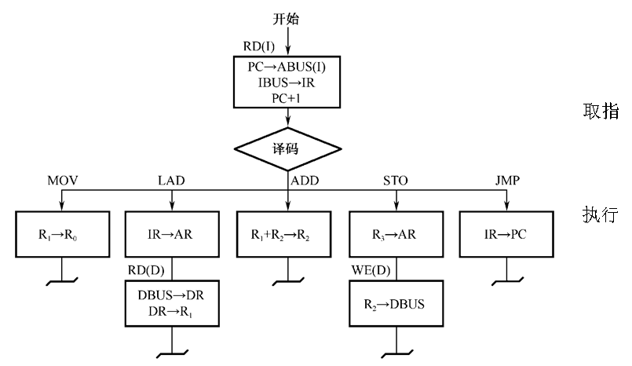

1. 列出微操作命令的操作时间表，包括各个机器周期、节拍下的每条指令完成的微操作控制信号。
   1. 原则一：被操作的先后顺序不能随意更改；
   2. 原则二：被控对象不同的微操作尽量安排在1个节拍内完成；
   3. 原则三：占用时间较短的微操作尽量安排在 1 个节拍。
2. 微操作信号综合：`微操作控制信号 = 机器周期……（懵逼脸）`
3. 画微操作命令逻辑图
   - 方框：按CPU周期
   - 方框内内容：数据通路操作或控制操作
   - 菱形符号：判别或测试
   - ~：公操作

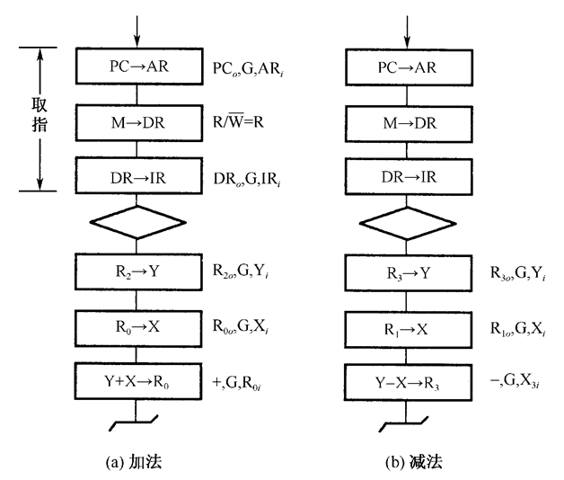

#### 微程序控制器

- 微操作：一条机器指令分解成 1 个微操作序列，微操作才是计算机中的最基本的原子操作。
- 微命令：**微命令是微操作的控制信号，微操作是微命令的执行过程。**
  - 相容性微命令：可以同时产生、共同完成某些微操作的微命令；
  - 互斥性微命令：机器中不允许同时出现的微命令。
- 微指令：若干个微命令的集合。
  - 操作控制字段（微操作码）
  - 顺序控制字段（下地址字段）
- 微程序：微指令的有序集合，一个微程序对应一条机器指令。
- 控制存储器：位于CPU内部用ROM实现

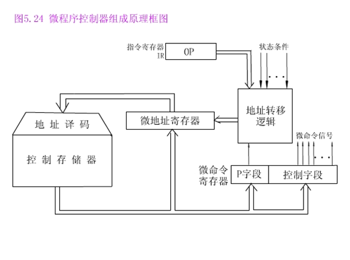

- CM：存放微程序
- CIR：存放CM取出的正在执行的微指令，位数与微指令字长相等
- 微地址形成部件：用来产生初始微地址和后继微地址
- CMAR：接受微地址形成部件送来的微地址，为下一步从CM中读取微指令做准备

若指令系统中具有 n 种机器指令，则控制存储器种的微程序数至少是 n+1个（1个为公共取指微程序）。

***微程序编码方式***

- 直接编码方式：无需译码，操作控制（微操作码）字段直接 log 2 N bit。
- **字段直接编码方式**：微命令字段分成若干小段，互斥性微命令组合在一个字段内，相容性微命令组合在不同字段中。注意每个小段要留出一个状态表明本字段不发出任何微命令。
- 字段间接编码：需要另一个字段的微命令解释本字段的某些微命令。

***微指令地址形成方式***

- 断定：由微指令的下地址字段给出。
- 由机器指令的操作码形成。
- 电源加电后的第一条微指令地址由专门的硬件电路产生。

***微指令的格式***

- 水平型：一次能定义并可以并行执行多个微命令的微指令。
  - 控制字段 + 判别测试字段 + 下地址字段
- 垂直型：由微操作码规定微指令的功能，一条垂直型微指令只能定义并执行一种基本操作。
  - 微操作码 + 目的地址 + 源地址

### 指令流水线

本质：把一条指令的执行过程分成多个阶段，不同阶段可以并行。

- 静态流水线：同一时间内，流水线各段只能按同一种功能的连接方式工作；
- 动态流水线：当某段正在实现某种运算时，另一些段在进行另一种运算。

流水线每一个功能段部件后面都要有一个锁存器，用来保存本流水段的执行结果，提供给下一流水段使用。

- 结构相关（资源冲突）：多条指令在同一时刻争用同一资源而形成的冲突；
  - 解决方案1：后一条等前一条访存完再访存
  - 解决方案2：资源重复配置
- 数据相关：执行后一条指令需要前面指令的执行结果；
  - 解决方案1：硬件阻塞或软件插入 NOP
  - 解决方案2：数据旁路
  - 解决方案3：编译器优化
- 控制相关：流水线遇到转移指令和其他改变PC值的指令二造成断流
  - 解决方案1：对转移指令进行分支预测，今早生成转移目标地址
  - 解决方案2：预取转移成功和不成功两个控制流方向上目标指令
  - 解决方案3：提前形成条件码

流水线性能指标：

- 吞吐率（单位时间可以完成多少任务）：任务数/完成任务用的总时间
  - 实际吞吐率= 任务数/（（k + n - 1）* 时钟周期）
  - 最大吞吐率= 1 / 时钟周期
- 加速比 = 顺序执行所用时间 / 流水线执行所用时间
- 效率 = n个任务占用 k 时空区的有效面积 / 总面积

超标量流水线：以并行操作方式将两条或多条指令编译并执行，需要配置多个功能部件。

## 总线

### 总线概述

总线的两个特点：

- 分时：同一时刻只允许有一个部件向总线发送信息。但多个部件可以同时从总线上接受相同的信息。
- 共享：总线上挂接的多个部件之间交换的信息都可以通过这组线路分时共享。

总线的猝发传输方式：在一个总线周期内传输存储地址连续的多个数据字。

分类：

- 片内总线：芯片内部
- 系统总线
  - AB
  - DB
  - CB
- 通信总线：远距离传输

性能指标：

- 总线周期：一次总线操作所需的时间
- 总线时钟周期 = 机器时钟周期
- 总线的工作频率 = 总线周期的倒数
- 总线宽度
- 总线带宽 = 总线宽度 * 总线工作频率

### 系统总线结构

- 单总线：CPU、主存、设备接口全部挂在一组系统总线上，所以彼此之间可以直接交换信息，但多个部件只能争用唯一的总线，而且不支持并发传送操作；
- 双总线：增加通道等硬件
  - 主存总线 ： CPU 与 主存交换信息
  - I/O总线：设备与通道间数据传送
- 三总线：提高了I/O设备性能
  - 主存总线：CPU与主存
  - I/O总线：CPU与外设
  - DMA总线：内存与高速外设

### 总线仲裁

#### 集中仲裁方式

将所有的设备请求集中于一个设备，采用一定的算法进行裁决。

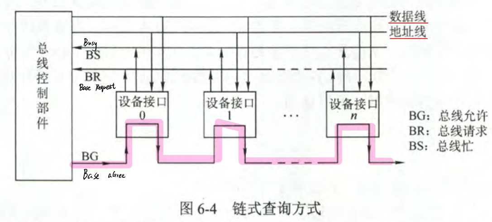

链式查询（故障敏感）：总线上所有部件公用一个BR、BS和BG。若某个设备想使用总线，通过BR发出请求，总线控制部件检查是否忙，忙的话就回馈BS信号；若不忙回馈BG信号，从最靠近总线控制部件的设备开始往下传，所以越靠近总线控制部件的设备优先级越高，在响应某设备的过程中很有可能被高优先级的设备抢占。

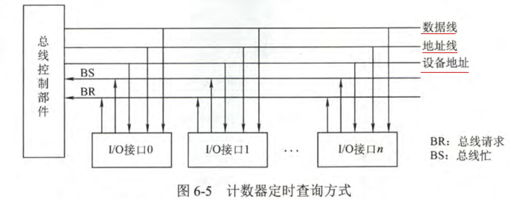

计时器定时查询方式：取消了总线响应线BG，多了一组设备地址线，所以 N 个设备需要添加 log 2 N条设备地址线。

 当总线控制器收到总线请求信号，判断总线空闲 时，计时器开始计数，计数值通过设备地址线发向各个部件。设备地址与计数值一致的设备获得总线控制权，同时终止计数及查询。

计数值可以从 0 开始，这样设备优先级依然固定；也可以从上一次的终点开始，这样就是循环方式，各设备使用总线的优先级相等

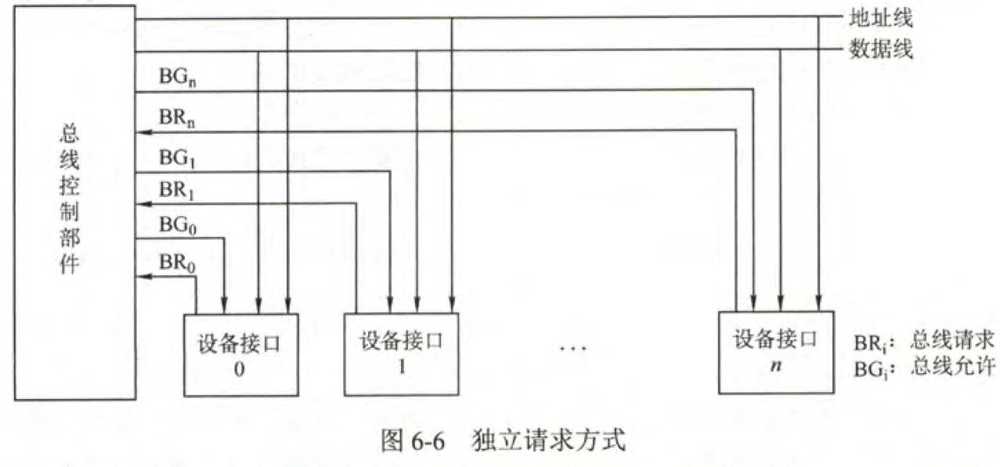

独立请求方式：每个设备都有一组自己的 BR和 BG，所以控制线条数为 2n + 1 。

每当设备请求总线使用权时，总线控制器按一定的优先次序决定给哪个设备使用，无需在设备间传递或者查询，对优先次序的控制相当灵活。

#### 分布仲裁方式

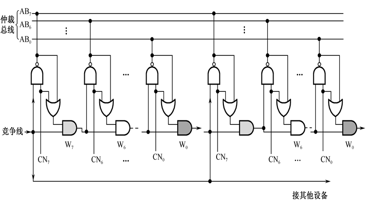

不需要中央仲裁器，而是多个仲裁器竞争使用总线。

当它们有总线请求时，把它们唯一的仲裁号发送到共享的仲裁总线上，每个仲裁器将仲裁总线上得到的号与自己的号进行比较。如果仲裁总线上的号大，则它的总线请求不予响应，并撤消它的仲裁号。最后，获胜者的仲裁号保留在仲裁总线上。

显然，分布式仲裁是以优先级仲裁策略为基础。

### 总线操作和定时

- 同步定时方式：系统采用统一的时钟信号协调发送和接收双方定时关系。主从设备具有强同步性，但可靠性较差，适用于总线长度较短和系统设备速度相差不大的系统。
- 异步定时方式：依靠传送双方相互制约的握手信号实现定时控制
  - 不互锁方式
  - 半互锁方式
  - 全互锁方式

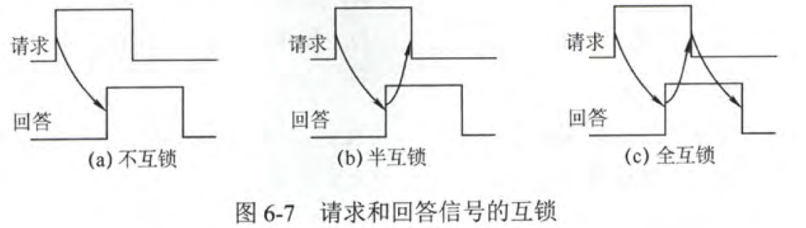

### 总线标准

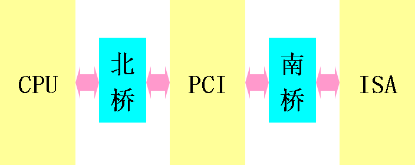

- Peripheral Component Interconnect 外设部件互联总线标准
  - 高性能的 32 bit 或 64 bit总线，为高度集成的外围部件、扩充插板和CPU/存储器系统设计的互联机制
  - 支持即插即用
  - 与CPU时钟频率无关的高速外围总线
  - 属于局部总线
  - 可以通过桥连接实现多层 PCI 总线
    - 桥实际上是一种具有缓冲、转换、控制功能的逻辑电路
- Industry Standard Architecture 工业标准体系结构总线：最早的系统总线标准。

## I/O系统

### 外部设备

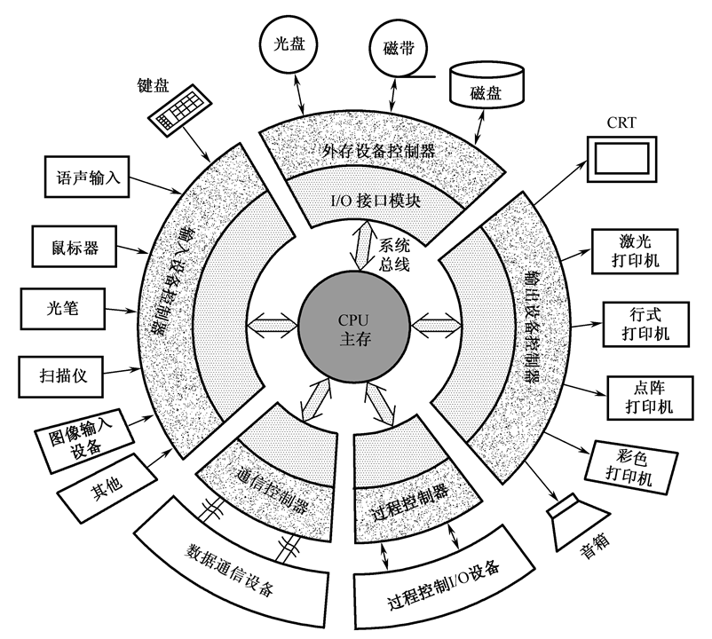

- 键盘、鼠标：慢速设备
- 显示器：分辨率 = 宽 * 高 * 灰度级
- 磁盘阵列
  - RAID0：无冗余和无校验的磁盘阵列
  - RAID1：镜像磁盘阵列
  - 2：采用纠错的海明码的磁盘阵列
  - 3：位交叉奇偶校验的磁盘阵列
  - 4：块交叉奇偶校验的磁盘阵列
  - 5：无独立娇艳的奇偶校验磁盘阵列
    磁盘计算题：见操作系统

### I/O接口：主机与外设之间的交换界面

I/O接口：若干个端口加上响应的控制逻辑。

功能：

- 控制主机与外设的通信
- 进行地址译码和设备选择
- 实现数据缓冲
- 信号格式的转换
- 传送控制命令和状态信息

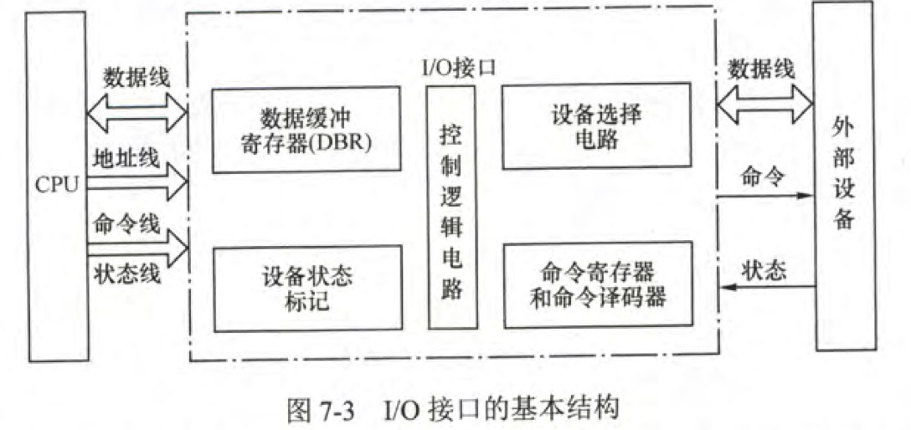

- 设备选择电路：设备选址
- 命令寄存器和命令译码器；传送命令
- 数据缓冲寄存器DBR：传送数据
- 设备状态标记：反馈设备状态
  - 完成触发器
  - 工作触发器
  - 中断触发器INTR
  - 屏蔽触发器MASK
- 控制逻辑电路：暂存命令并转换为外部设备控制信号

#### I/O端口及其编址

I/O端口 ： 接口电路中可以进行读/写的寄存器，CPU可以直接访问，所以必须要有端口地址。

- 统一编址（存储器映射方式）：把I/O端口当作存储器的单元进行地址分配，不需要设置专门的I/O指令，用访存指令就可以访问I/O端口。
- 独立编址（I/O映射方式）：CPU需要设置专门的I/O指令访问端口。

### I/O控制方式

定义：主机与I/O设备之间数据传送采用的控制方式。

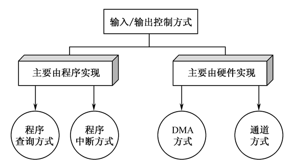

#### 程序查询方式

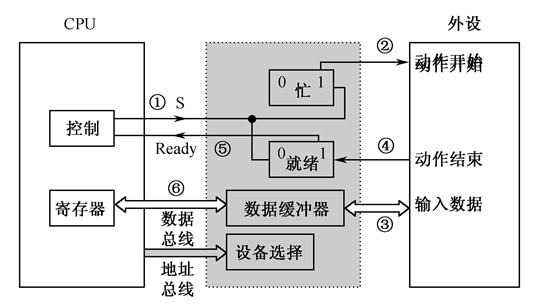

1. CPU先向I/O设备发出命令字，请求进行数据传送；
2. 从IO接口读入状态字；
3. CPU检查状态字中的标志，看看数据交换是否可以进行；
4. 加入这个设备没有准备就绪，则一直进行步骤 2 和步骤 3 ，直到设备准备就绪发出 ready 信号为止；
5. CPU从 I/O 接口的数据缓冲寄存器中输入数据，或将数据从 CPU 输出到接口的数据缓冲寄存器中。同时，CPU将接口中的状态标志位复位。
6. 数据传送

#### 程序中断方式

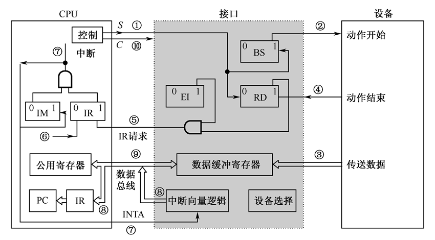

1. 程序启动外设，将外设接口忙标志的 BS 置1，准备就绪标志 RD 清0；
2. 接口向外设发出启动信号；
3. 数据由外设传送到接口的缓冲寄存器；
4. 当设备动作结束或缓冲寄存器数据填满时，设备向接口发送一控制信号，将数据准备就绪 RD 置为1；
5. 允许中断标志 EI == 1时，接口向CPU发出中断请求信号；
6. **一条指令执行末尾**CPU检查中断请求线，将中断请求线的请求信号接受到“中断请求”标志 IR；
7. 如果“中断屏蔽”标志 IM == 0，CPU在一条指令执行结束后受理外设的中断请求，向外设发出响应中断信号并关闭中断；
8. 转向该设备的中断服务程序入口
9. 在终端服务程序通过输入指令把接口中数据缓冲寄存器的数据读至 CPU 中的寄存器；
10. CPU发出控制信号 C 将接口中的 BS 和 RD 复位。

#### DMA方式（Direct Memory Access）

由 **DMA控制器给出当前正在传送的数据的主存地址**，并统计传送数据的个数以确定一组数据的传送是否已结束。在**主存中要开辟连续地址的专用缓冲器**，用来提供或接收传送的数据。在数据**传送前和结束后要通过程序或中断方式对缓冲器和DMA控制器进行预处理和后处理**。

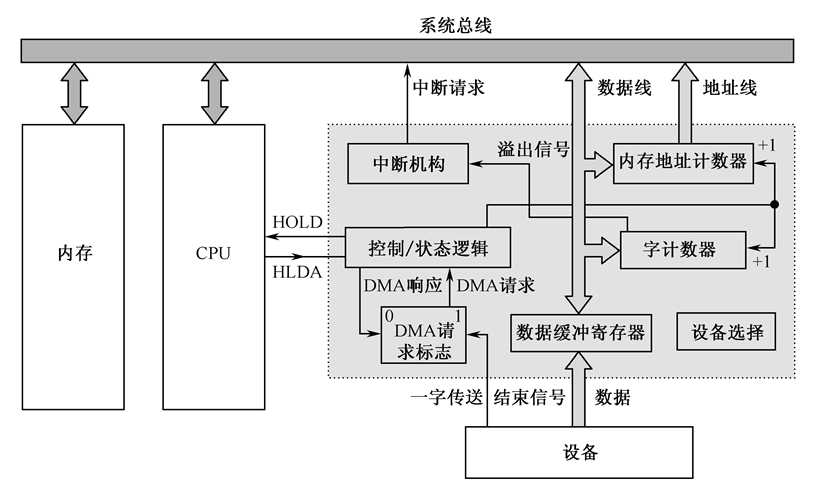

- 内存地址计数器：存放内存中要交换的数据地址。
  - 每次DMA传送前，通过程序将数据在内存中的起始位置送到内存地址计数器；
  - DMA传送时，每交换一次数据，将地址计数器 + 1，从而以增量方式给出内存中要交换的一批数据的地址。
- 字计数器：记录传送数据块的长度。
  - DMA传送前由程序预设；
  - DMA传送时，每传送一个字，字计数器就 + 1；
  - 当计数器溢出（最高位产生进位）时，代表数据传送完毕，DMA控制器向CPU发出中断信号。
- 数据缓冲寄存器：暂存每次传送的数据（一个字）。
- DMA请求标志
  1. 设备准备好一个数据字后给出一个控制信号，DMA请求置1；
  2. DMA请求标志向控制状态逻辑发出DMA请求；
  3. 控制/状态逻辑向CPU发出总线使用权的请求（HOLD）；
  4. CPU发出响应信号HLDA；
  5. 控制/状态逻辑接收信号后发给DMA请求标志复位，为交换下一个字做好准备。
- 控制/状态逻辑：
  - 修改内存地址计数器和字计数器
  - 指定传送类型（输入或输出）
  - 对DMA请求信号和CPU响应信号进行协调和同步
- 中断机构：字计数器溢出时，由溢出信号触发中断机制，向CPU提出中断报告数据传送结束。

##### DMA传送过程

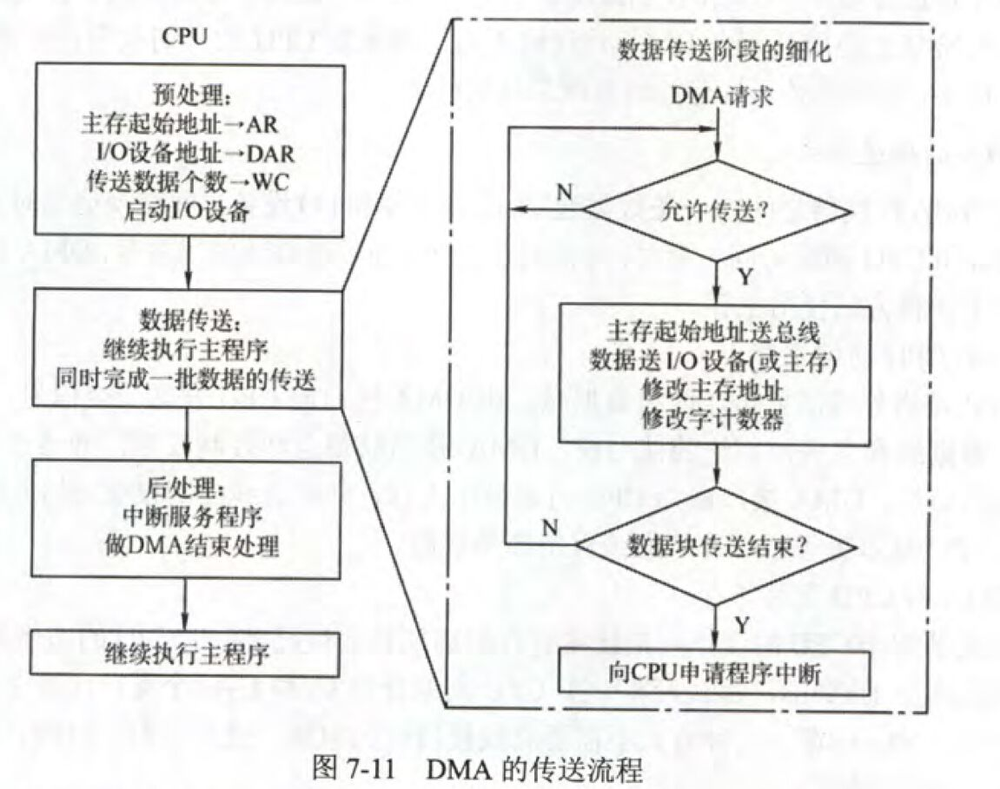

##### DMA传送方式

DMA方式是**通过硬件控制实现主存与I／O设备间的直接数据传送**，在传送过程中无需CPU的干预。数据传送是在DMA控制器控制下进行的。

在DMA传送过程中，主存和I/O设备间有一条直接通路，不通过CPU。但当I/O设备和CPU同时访问主存时，就会可能发生冲突，在传送过程中DMA控制器和通常用以下三种方式使用主存。

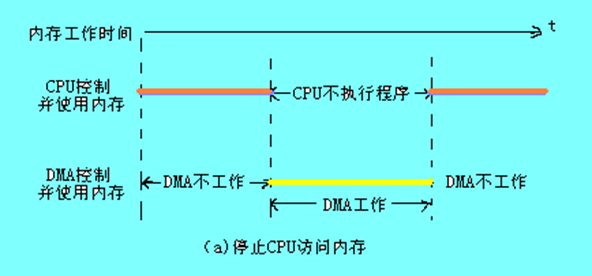

- CPU暂停方式
  - DMA向CPU申请总线
  - CPU暂停
  - DMA传输
  - DMA释放总线
  - CPU继续

采用这种工作方式的I／O设备，在其接口中一般设置有小容量存储器，I／O设备先与小容量存储器交换数据，然后由小容量存储器与主机交换数据，这样可减少DMA传送占用存储总线的时间，也即减少了CPU暂停工作的时间。

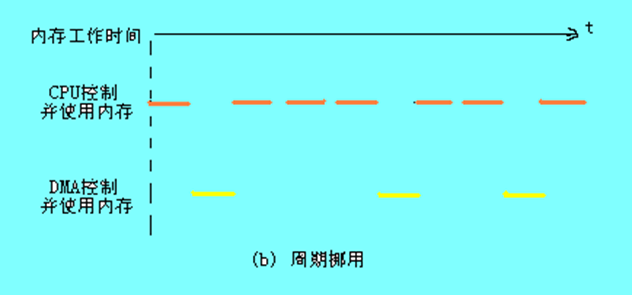

- 周期挪用：DMA控制器与主存之间传送一个数据窃取一个CPU周期，CPU只暂停工作一个周期，然后继续执行程序。
  - CPU不访存时：DMA直接用
  - CPU正在访存：DMA等待CPU完成（总线周期结束），然后获得总线使用权
  - CPU与DMA同时发生：DMA先用，否则数据会丢失
  - I/O设备每次挪用一个主存周期都需要申请、建立再归还，所以尽管只传送一个字，对于DMA接口而言，实质上要占用2-5个主存周期。

- DMA和CPU交替访问内存：不需要总线使用权的建立和归还过程，总线使用权是通过C1和C2分别控制的。
  - 如果CPU的工作周期比内存周期长很多时可以采用该方法；
  - 总线控制权的转移速度快，DMA效率高。

### 通道方式

通道：计算机系统中代替CPU管理控制外设的独立部件，是一种能执行有限I/O指令集合（通道命令）的I/O处理机。

一个主机可以连接多个通道，每个通道又可以连接多个I/O设备。程序和外设完全可以并行执行。

在CPU启动通道后，**通道自动地去内存取出通道指令并执行指令**。直到数**据交换过程结束向CPU发出中断请求**，进行通道结束处理工作。

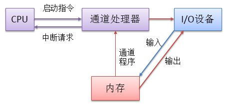

1. CPU组织通道程序放入内存中；
2. CPU给通道发出I/O指令启动；
3. 通道处理；
4. 通道处理完成后给CPU发出中断请求，进行通道结束处理工作；

-------------------

参考资料：《2019王道计算机组成原理》、教学课件、CSAPP、部分博客等

Cache和虚存大题会开一篇专门讲，可变长指令结构、中断屏蔽字、流水线等也是需要理解的东西，真正理解都不难，只是简单的放一段话或文字也很难直接明白是怎么回事。计算机组成原理需要系统的理解，死记硬背不能根本解决问题。
