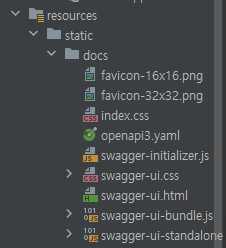
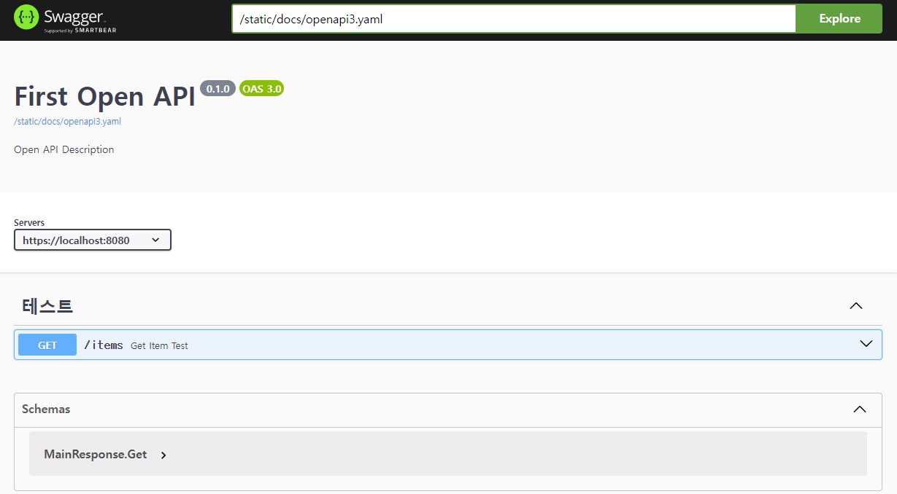

# OpenAPI

Swagger + Restdocs 의 장점을 한대 모은 **OpenAPI Specification** 을 사용하는 예시를 간략 정리했다.

start.spring.io에서 **Spring REST Docs**를 추가했다고 가정하고 추가한 요소에 대해서만 작성한다.

## Dependency

```groovy
plugins {
    id 'java'
    id 'org.springframework.boot' version '3.1.3'
    id 'io.spring.dependency-management' version '1.1.3'
    id 'org.asciidoctor.jvm.convert' version '3.3.2'
    id 'com.epages.restdocs-api-spec' version '0.18.2'  // 추가
}

group = 'com.openapi'
version = '0.0.1-SNAPSHOT'

java {
    sourceCompatibility = '17'
}

configurations {
    compileOnly {
        extendsFrom annotationProcessor
    }
}

repositories {
    mavenCentral()
}

ext {
    set('snippetsDir', file("build/generated-snippets"))
}

dependencies {
    implementation 'org.springframework.boot:spring-boot-starter-web'
    compileOnly 'org.projectlombok:lombok'
    annotationProcessor 'org.projectlombok:lombok'
    testImplementation 'org.springframework.boot:spring-boot-starter-test'
    testImplementation 'org.springframework.restdocs:spring-restdocs-mockmvc'
    testImplementation 'com.epages:restdocs-api-spec-mockmvc:0.18.2'         // 추가**
}

tasks.named('test') {
    outputs.dir snippetsDir
    useJUnitPlatform()
}

tasks.named('asciidoctor') {
    inputs.dir snippetsDir
    dependsOn test
}

// 추가
openapi3 {
    server = "https://localhost:8080"
    title = "First Open API"
    description = "Open API Description"
    version = "0.1.0"
    format = "yaml"
}

bootJar{
   dependsOn(':openapi3')
}

// 추가
task copyTest {
    dependsOn("openapi3")
    copy {
        from "$buildDir/api-spec/openapi3.yaml"
        into "src/main/resources/static/docs/."
    }
}
```

- **plugin 버전 호환성**

| Spring Boot version | restdocs-api-spec version |
| --- | --- |
| 3.x | 0.17.1 or later |
| 2.x | 0.16.7 |

- [restdocs-api-spec-restassured](https://github.com/ePages-de/restdocs-api-spec/blob/master/restdocs-api-spec-restassured) : 만약 RestAssured를 사용한다면 이 의존성을 추가하자.
- openapi3 : 타이틀 및 세부 정보 설정
- task copyTest {..} : 직관적으로 알 수 있듯, build에 있는 yaml을 src 아래에 옮긴다.

## Swagger 정적 파일 다운로드

다운로드 : [source link](https://github.com/swagger-api/swagger-ui/releases/tag/v5.4.2)

소스 코드를 다운 받아 /dist 파일만 가져온다.

### 파일 삭제

- oauth2-redirect.html
- swagger-ui.js
- swagger-ui-es-bundle-core.js
- swagger-ui-es-bundle.js

### 파일 수정

- 해당 폴더를 ‘/dist’ → ‘/docs’ 로 변경하여 src/resources/static/ 아래에 옮겨놓는다.
- index.html은 이름 그대로 사용해도 되며 swagger-ui.html로 변경하자(선택)



- swagger-ui.html 내부의 src 경로를 모두 static 하위로 변경한다.

## 접근 허용 및 View 설정

```java
@Configuration
public class StaticRoutingConfigure implements WebMvcConfigurer {

    @Override
    public void addResourceHandlers(ResourceHandlerRegistry registry) {
        registry.addResourceHandler("/static/**").addResourceLocations("classpath:/static/");
    }

    @Override
    public void addViewControllers(ViewControllerRegistry registry) {
        registry
            .addViewController("/swagger-ui").setViewName("static/docs/swagger-ui.html");

    }
}
```

## 테스트용 컨트롤러

```java
@RequestMapping("/items")
@RestController
public class ItemController {

    @GetMapping
    public ItemResponse getItem() {
        return new ItemResponse(1, "쌍쌍바", 1000,50);
    }
}
```

## 테스트 코드

```java
class ItemControllerTest extends BaseIntegrationTest {

    @DisplayName("Get Item 테스트")
    @Test
    void getItem() throws Exception {
        // given
        mockMvc.perform(
                get("/items")
            )
            .andExpect(status().isOk())
            .andExpect(jsonPath("$.name").value("쌍쌍바"))
            .andDo(document("item-get",
                builder()
                    .tag("테스트")
                    .summary("Get Item Test")
                    .description("아이템이 오는지 확인한다.")
                    .responseSchema(Schema.schema("MainResponse.Get"))
                ,
                preprocessRequest(prettyPrint()),
                preprocessResponse(prettyPrint()),
                responseFields(
                    fieldWithPath("id").type(JsonFieldType.NUMBER).description("아이디"),
                    fieldWithPath("name").type(JsonFieldType.STRING).description("이름")
                    , fieldWithPath("price").type(JsonFieldType.NUMBER).description("가격")
                    , fieldWithPath("quantity").type(JsonFieldType.NUMBER).description("수량")
                )
            ));
    }
}
```

## swagger 접속

테스트 코드까지 모두 끝났다면 처음에 작성했던 task copyTest 를 작성하거나 build를 실행하자. 그리고 [localhost:8080/swagger-ui](http://localhost:8080/swagger-ui) 로 접속하면 아래와 같이 swagger 페이지가 완성된다.

